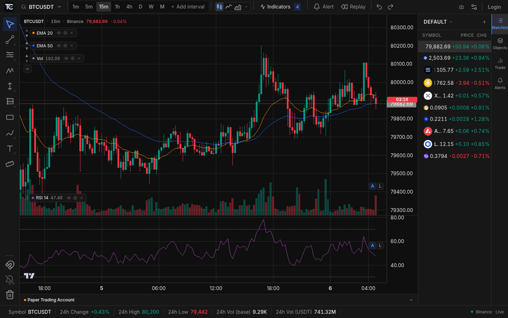
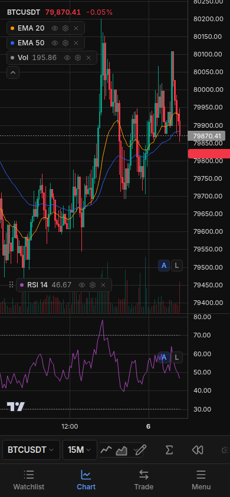

# TradingChart 📈

> **An open-source, 100% free alternative to TradingView Pro.**
> Live candles, custom indicators, drawing tools, alerts, bar replay — no fees, no ads.

A crypto charting platform built on **Binance**'s public data (WebSocket) and the same rendering library TradingView itself uses ([`lightweight-charts`](https://github.com/tradingview/lightweight-charts)).

---

## 📸 Screenshots

| Desktop | Mobile |
|:---:|:---:|
|  |  |

---

## 🙏 Based on

This project descends from two prior open-source efforts. The earliest MVP —
Spanish, single-file, Binance WebSocket candles and a handful of indicators —
was built by **KManuS88** [outlinersclub-cpu/tradingview-gratis](https://github.com/outlinersclub-cpu/tradingview-gratis). It was later forked from
[KisuShotto15/tradingview](https://github.com/KisuShotto15/tradingview), a
Next.js + lightweight-charts + Binance WS TradingView clone built as a free
alternative for LATAM, which is where the Supabase auth, cloud sync, and
drawing system originated before this repo grew the rest.

---

## ✨ Features

- 📊 **Live candles** via Binance's WebSocket (no API key)
- 🔍 **Symbol search** across every USDT pair on the exchange
- ⏱️ **Multi-timeframe**: 1m / 5m / 15m / 1h / 4h / 1d / 1w
- 📐 **Client-side indicators**: EMA, RSI, MACD, Bollinger Bands, VWAP, Volume Profile, oscillators
- ✏️ **Drawing tools**: trend lines, Fibs, rectangles, channels, positions and more, persisted + cloud-synced
- 🔔 **Price alerts** with in-app notifications
- ⏪ **Bar replay** for practice and manual backtesting
- 🧪 **Paper trading** — simulated market/limit orders with leverage, live P&L, TP/SL and trade history, synced to your account
- 👁️ **Watchlist** with prices and 24h change updating in real time
- 🎨 **Visually identical to TradingView** (palette, fonts, layout)
- 💾 **Persistence** in localStorage (symbol, timeframe, indicators)
- 🔌 **Robust WebSocket reconnection** with exponential backoff
- 🌐 100% client-side — static deploy on Vercel/Cloudflare

## 🚀 Getting started

```bash
npm install
npm run dev
```

Open [http://localhost:3000](http://localhost:3000).

## 🌐 Deploy to Vercel

```bash
npm i -g vercel
vercel
```

Or connect the repo at [vercel.com/new](https://vercel.com/new) for automatic deploys. There are no environment variables — everything is client-side.

## 🧠 How it works

### Historical data
Opening a symbol fires a `GET /api/v3/klines` (REST) that brings back the last **1000 candles** for the active pair + timeframe. They render instantly.

### Live data
A single multiplexed WebSocket connection (`stream.binance.com`) receives:
- `<symbol>@kline_<interval>` → updates to the current candle + candle closes
- `<symbol>@miniTicker` → watchlist tickers

On reconnect (Binance drops the WS every 24h) every active stream is resubscribed with exponential backoff.

### Indicators
They are computed **client-side** over the candle array on every update. Pure TypeScript implementations:
- `EMA`: seeded with the SMA of the first period, then `close * k + prev * (1-k)`
- `RSI`: Wilder (exponential smoothing over gains/losses, period 14)
- `MACD`: EMA(12) − EMA(26), signal = EMA(9) over the MACD line

For 1000 candles and multiple panes the cost is negligible.

## ⚠️ Not included (yet)

- ❌ Pine Script (proprietary to TradingView, can't be cloned)
- ❌ Server-side alerts (alerts currently run client-side)
- ❌ Screener / scanner over the full exchange universe

`lightweight-charts` is Apache 2.0 with attribution to TradingView — the attribution lives in the footer/UI as the license requires.
